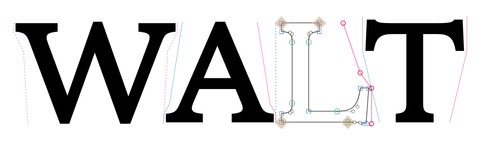

# PolyKern

*Renamed from BubbleKern2 on 2026-09-02. The plugin, its classes, its
custom parameters and the keys it writes into a font all say PolyKern now;
bubbles drawn by the old plugin are not read by this one.*

A set of GlyphsApp plugins that allows you to kern fonts in a more visual way. Unlike the original BubbleKern, it is based on the polygonal data format for the balance of data/computation efficiency and user experience.

Currently in alpha state.

This is a fork of [Tosche/BubbleKern](https://github.com/Tosche/BubbleKern) by Toshi Omagari. The two plugins below are his; everything under *Added in this fork* is built on top of them.

## Installation
Install PolyKernCentral.glyphsPlugin by double-clicking it (assuming you already have GlyphsApp).
It’s a work in progress and purposefully unavailable on Plugin Manager for now.

## Plugins
- PolyKern Tool: A new tool to draw bubbles. Each glyph contains two polygonal bubbles on the left and right.
- PolyKern Kerner: A dialogue-based plugin to generate kerning data or export font with experimental *BBLH* table.

## Added in this fork
- Automatic bubbles: each side is measured from the ink profile of the glyph and pushed out by one gap, so a bubble follows the outline instead of being drawn node by node.
- Four ways to give a side its shape: draw it by hand, type `auto` to keep it generated from the outline, type another glyph’s name to borrow that glyph’s bubble, or type `=|` to mirror the other side of the same glyph.
- Composite glyphs: a composite takes its bubbles from its components, so Á kerns as the A and the accent it is made of.
- Set Refer Glyphs automatically: groups the glyphs whose sides kern alike, and shows the result as the glyphs themselves with the measured bubble drawn on each.
- Settings panel: a floating window with a live preview — a line of text spaced by the bubbles, redrawn as the sliders move.
- PolyKern parameter: the settings are stored per font or per master as a custom parameter, with its own editor in Font Info.
- Set Bubble Settings based on Kerning: solves for the gap that best reproduces the kerning already in the font, so an existing family can be matched rather than respaced.
- Grid: bubble nodes can snap to an optional grid, drawn in the edit view.
- Overwrite confirmation: generating over a selection says how many sides already hold work — drawn by hand, borrowed from another glyph or mirrored from the other side — and offers to generate only the empty ones instead. Sides set to `auto` are never counted: they asked to be kept up to date.
- Stale bubbles: a bubble is flagged when the outline has moved under it, and follows a sidebearing change on its own.
- Info section: each side’s reference field and auto-generate button, and the selected node’s X and Y, sit beside GlyphsApp’s own info box.
- Live kerning: the kern value against the neighbours is shown, and kept up to date, while a bubble node is dragged.
- Kerning groups: the Kerner can write groups rather than flat pairs, and can be narrowed to the pairs that actually occur in text.
- Tests: 177 tests covering the parts that are pure Python, run without GlyphsApp.

## Test files
In the *Demo files* folder:
- BK Test Serif: Toshi’s open-source sample roman file with pre-drawn bubbles.
- BKTestSerif-Regular.otf: the font file with BBLH table.
- PolyKernTester.html: currently the only place where you can test dynamic kerning using *BBLH* table.

## Scripts
In the *Scripts* folder, to be run from GlyphsApp's Script menu:
- Rename BubbleKern data to PolyKern: a file drawn with the old plugin keeps its
  bubbles in the file but PolyKern reads nothing under the old name. This renames
  every key holding it, custom parameters included, one undo step per glyph. Set
  `REVERSE = True` at the top of the script to go back.

## Missing features / To dos
- Right to Left kerning.
- Vertical kerning.
- Copying & pasting of nodes.
